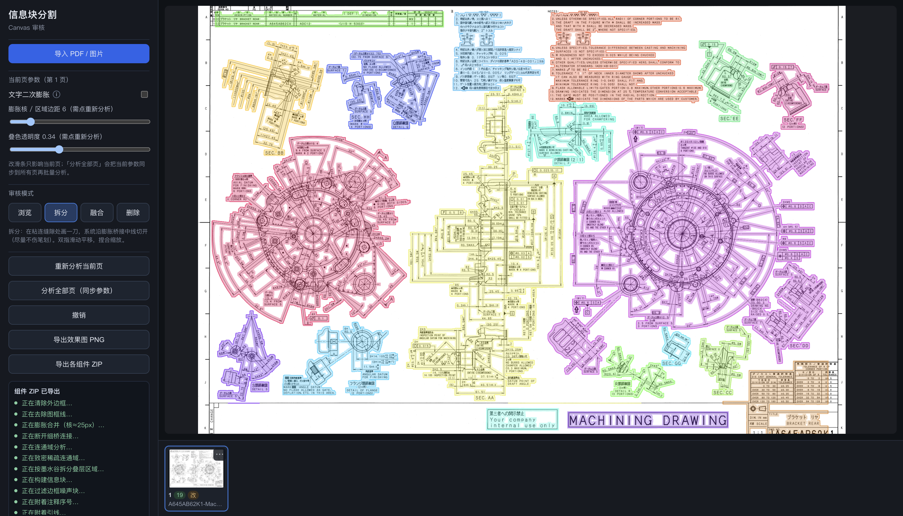
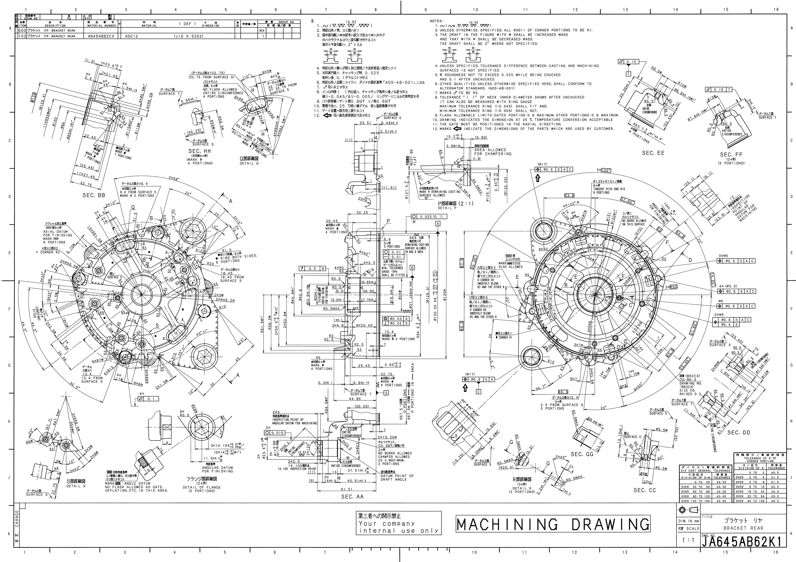
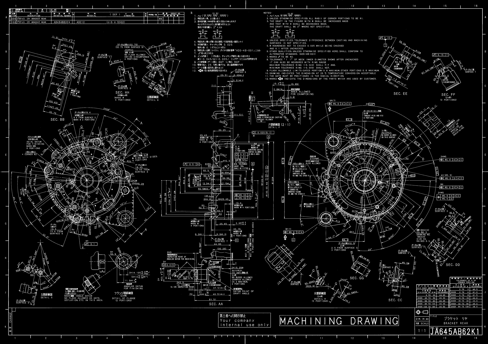
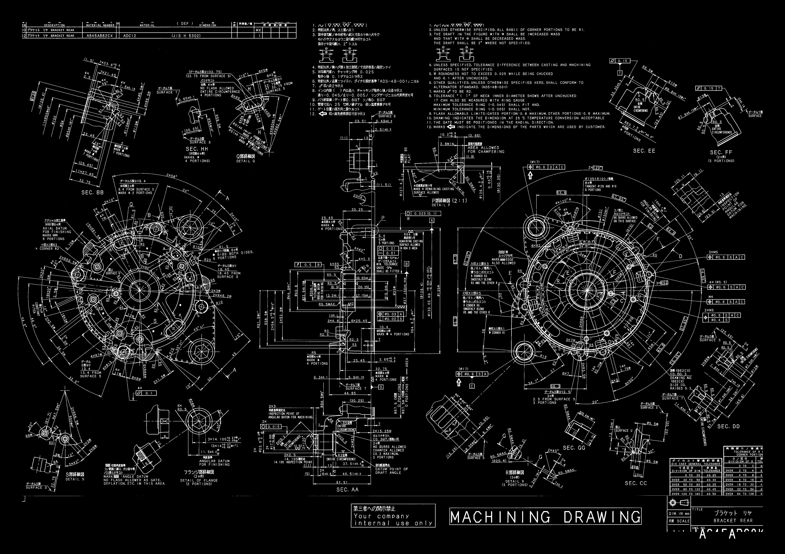
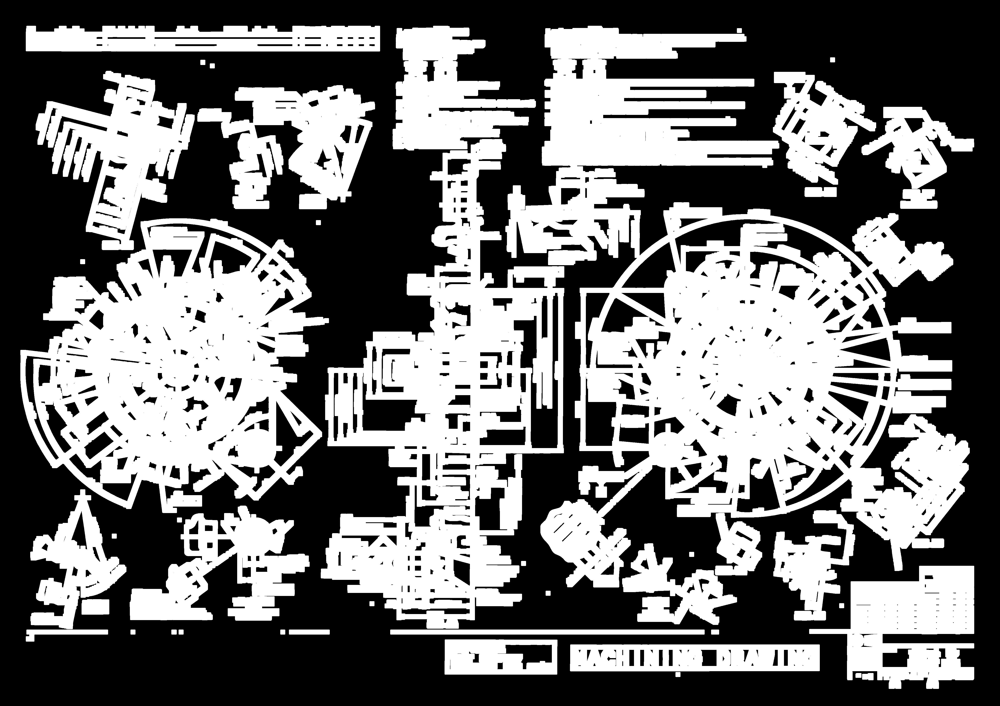
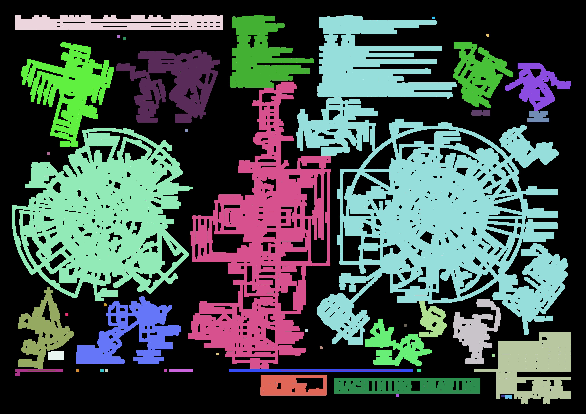
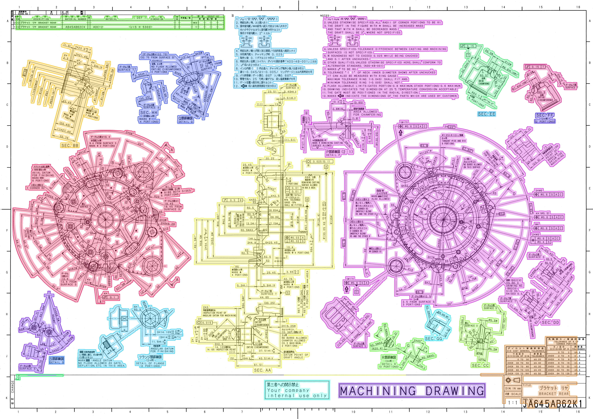
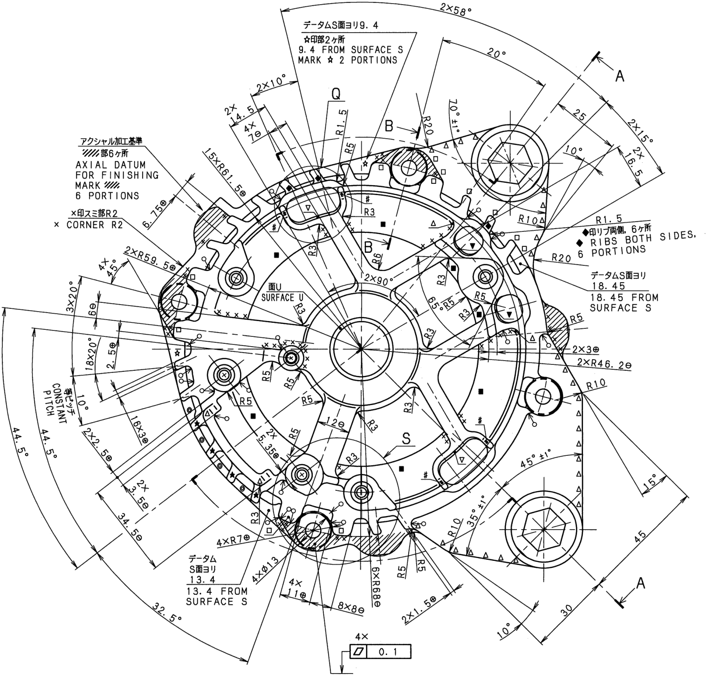

# 工程图纸信息块分割（Info-Block Segmentation）



面向机械 / 铸造等 **工程图纸** 的轻量信息区域分割方案：无需预先框选矩形，即可把视图、标题栏、尺寸注记、比例文字等「信息块」自动切开，并支持 **Web 人工审核** 与导出。

适合 CAD 审图、图纸结构化预处理、区域裁剪入库等场景。

---

## 能解决什么问题？

工程图纸上往往没有干净的矩形包围盒：视图与文字靠得很近、膨胀后容易粘连，标题栏与图框线又会「吞掉」整页。本项目针对这类难点提供：

| 痛点 | 本项目做法 |
|------|------------|
| 没有现成矩形框，难以按区域处理 | 二值化 → 近邻膨胀 → 连通域，直接得到信息块 |
| 字与字、字与视图间距不一，一刀切不准 | 可调膨胀核（区域边距）；可选「文字二次膨胀」专门合并碎字 |
| 外框线把整页粘成一块 | 边框清理 / 边框线剥离，保留内部图元 |
| 自动结果仍有粘连或误切 | Web 端手动 **拆分 / 融合 / 删除** 审核 |
| 需要给下游用裁剪件或叠色效果图 | 一键导出叠色 PNG、各组件 ZIP |

> 算法核心是经典视觉管线（OpenCV 形态学 + 连通域），可选 OCR 辅助文字合并；**不依赖大模型推理**，本地即可跑通。

---

## 总体流程（样例走读）

仓库 [`sample/`](sample/) 提供示例加工图纸 [`A645AB62K1-Machining.pdf`](sample/A645AB62K1-Machining.pdf)，以及 Web 审图跑通后的过程图与导出结果（见 [`sample/output/`](sample/output/)）。下面按真实流水线顺序说明原理与用法。

```text
PDF/图片导入
  → 渲染原图
  → 二值化
  → 清除最外层边框
  → 去图框线
  → 膨胀合并（gap）
  → 连通域着色
  → 叠色预览
  →（可选）人工拆分 / 融合 / 删除
  → 导出叠色图 / 各组件裁剪
```

### 0. 原图（PDF 渲染）

导入 PDF 后先按页渲染成位图。后续所有步骤都在这张图上做像素级处理。



### 1. 二值化

把灰度图纸变成「墨迹 / 背景」二值图，作为膨胀与连通域的前景。



### 2. 清除边框

擦掉最外圈页边带，避免整页图框与内部视图粘成一个超大连通域。


### 3. 去图框线

在边框带及标题栏上下区域，去掉跨页宽的长水平 / 竖直图框线，尽量保留中间剖视、尺寸线等有效笔划。



### 4. 膨胀合并

用可调膨胀核（Web 侧栏「膨胀核 / 区域边距」）把间距小于阈值的笔划并在一起：核越大，越容易把近邻注记与视图收成同一信息块。



### 5. 连通域着色

对膨胀后的掩膜做连通域分析，每个候选信息块着不同颜色，便于检查是否粘连或过碎。



### 6. 叠色结果（自动分析预览）

把各连通域半透明叠回原图，并描边。这是 Web Canvas 上「分析完成」后的默认视图；也可打开「文字二次膨胀」对碎字再合并后重跑。



### 7. Web 审图界面

在浏览器中可调参数、翻页，并用 **拆分 / 融合 / 删除** 修正自动结果（拆分时笔画即边界：大块保色、小块新色）。


### 8. 导出组件裁剪

审核满意后可导出各信息块 ZIP。例如某一视图裁剪件：



### 9. 导出整页叠色效果图

最终整页叠色 PNG，便于存档或给下游对照：


**怎么自己复现：** 启动 Web（见下方「快速开始」）→ 导入 `sample/A645AB62K1-Machining.pdf` → 点重新分析 → 在过程图里对照上述步骤 → 需要时手动审核 → 导出效果图 / 组件 ZIP。

---

## 功能一览

### 自动分割

- 图纸二值化与可选去线（全局 / 仅边框长线）
- 外页边框带清理，避免标题栏被框线吞并
- **膨胀核 `gap_thres`**：控制「多远的笔划仍算同一块」（相对 1200px 参考宽度自动缩放）
- 连通域提取信息块，叠色可视化（半透明区域色 + 描边）
- **文字二次膨胀**：对文字类区域用更大核再合并，减少注记被切碎

### Web 审核

- 批量导入 **PDF / PNG / JPG**（多页 PDF 自动拆页）
- 分页切换；参数按页保存
- Canvas：**平移**、**拆分**（笔画即边界，大块保色、小块新色）、**融合**、**删除**、撤销
- 查看中间过程图（二值化、膨胀、去图框线等）
- 导出当前页叠色效果图、各信息块裁剪 ZIP

---

## 快速开始

### 环境

- Python 3.10+
- Node.js 18+
- PDF 推荐：`pip install pymupdf`（无需系统 poppler）

### 启动 Web 审图

```bash
# 终端 1 — 后端
pip install -r requirements.txt
python -m uvicorn backend.main:app --reload --host 0.0.0.0 --port 8000

# 终端 2 — 前端
cd frontend && npm install && npm run dev
```

浏览器打开：<http://127.0.0.1:5173>

示例图纸与过程输出在 [`sample/`](sample/)（含 Machining PDF 与 [`sample/output/`](sample/output/) 配图）。

---

## 仓库结构

```
image_seg/
  segm/          # 分割算法（extract / visualize / text_refine / export）
  backend/       # FastAPI（分析、审核编辑、导出）
  frontend/      # Vite + Vue3 + Canvas 审核界面
  sample/        # 示例 PDF + output 过程图 / 导出结果
  requirements.txt
```

---

## 主要参数（Web 侧栏）

| 参数 | 作用 |
|------|------|
| `gap_thres` / 膨胀核 | 笔划相距多远仍合并（改后需重新分析） |
| 文字二次膨胀 | 碎字再合并；勾选后需重新分析当页 |
| `text_gap_thres` | 文字专用更大膨胀核 |
| `alpha` | 叠色透明度 |

---

## 未来可持续优化

1. **大规模组件拆分耗时**  
   组件数量多、图纸分辨率高时，手动拆分及叠色刷新会略慢。后续可继续 ROI 局部重绘、异步任务或更轻量预览编码。

2. **最外层边框清理的误伤**  
   去除最外圈边框时，靠近图框边缘的有效信息有可能被误删。后续可更精细区分「纯图框线」与贴边有效内容，并提供可调保护带。

欢迎针对以上两点提 Issue 或 PR。

---

## 许可与说明

本仓库为工程图纸信息块分割的研究 / 演示实现，便于本地试用与二次集成。若用于生产，请结合贵司图纸规范做参数标定与质检流程。

问题与建议欢迎提 Issue / PR。
